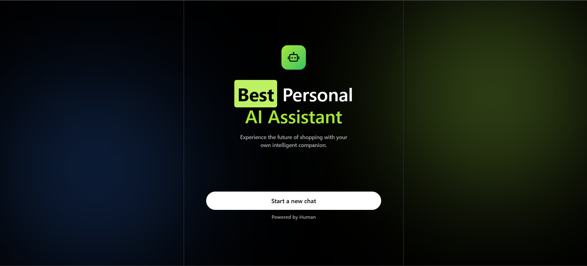
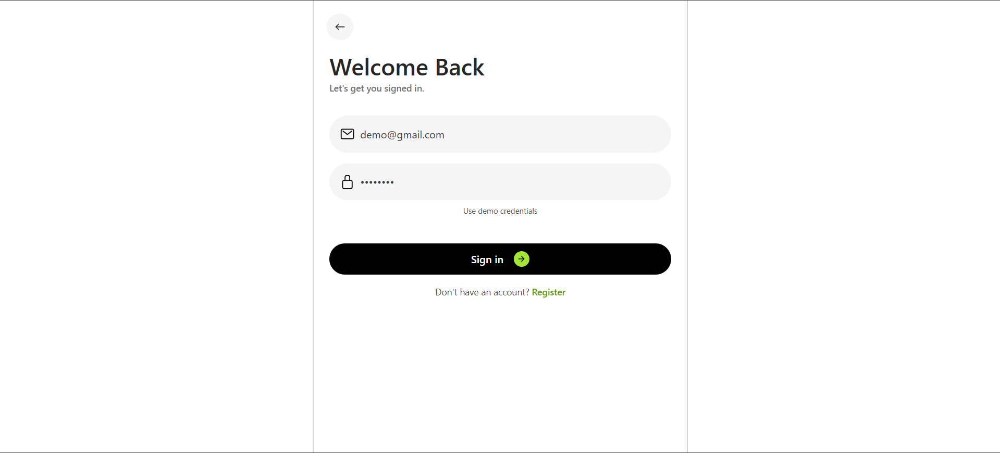
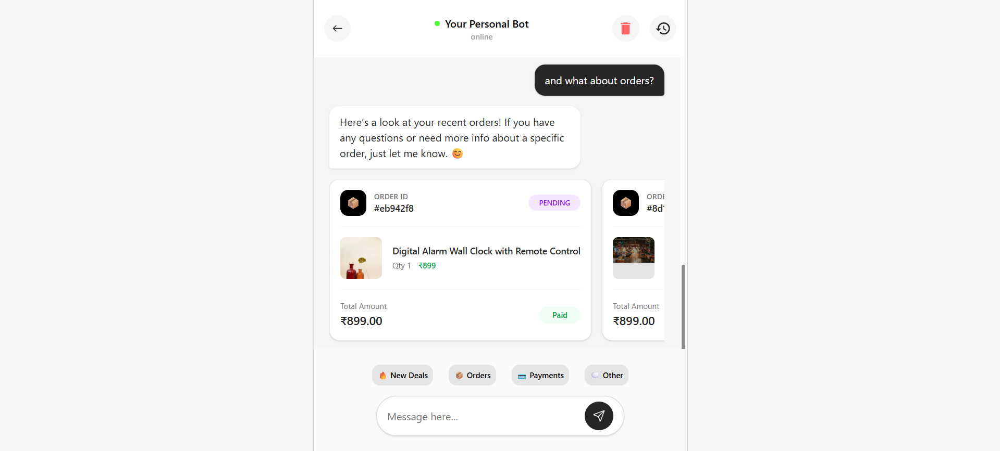
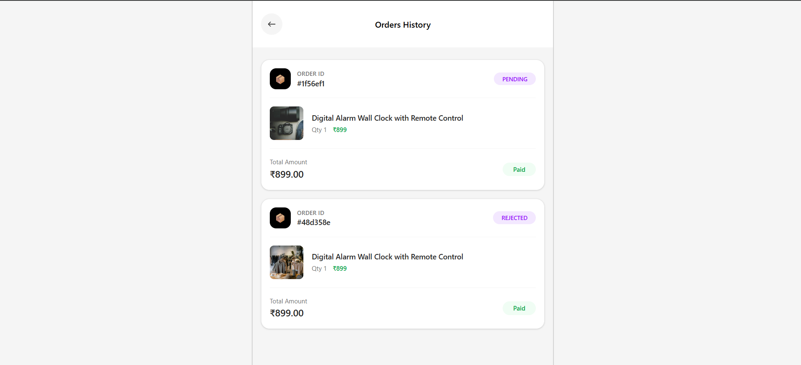

so hello my name is Amitesh Singh

this is my full stack assignment which is a interactive chat-bot

the tech stack used in this project is 

- monorepo
- bun
- nextjs
- express
- drizzle
- postgresql
- docker
- openai api
- langchain

and below is the high level architecture design of the assignment

and below is the video of mine with the working demo and explaining the assignment

and below are all the screens that we have

Landing page

Sign up page

Sign in page

Chat page

Order page
